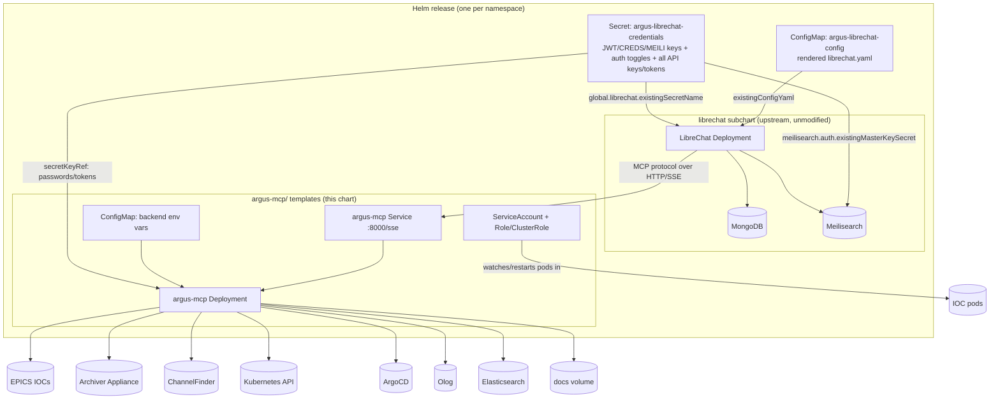

# Chart Architecture

## Why a ConfigMap + Secret in front of the subchart, instead of setting its values directly

Helm resolves **all** chart and subchart values statically, then renders
templates — a parent chart's template output can never flow into a
subchart's value tree within the same `helm install`/`upgrade`. The
upstream `librechat` chart anticipates exactly this with two escape
hatches: `librechat.existingConfigYaml` (a ConfigMap name) and
`global.librechat.existingSecretName` (a Secret name) — both consumed as
plain resource references, not computed values. This chart's own
templates render the actual ConfigMap/Secret content (composed from
`llm.endpoints`, `mcpServers`, `argusMcp`, and `auth.mode` — all of which
need real conditional logic) and point the subchart at them by name.

Because subchart values can't be templated, those two resource names are
**fixed literals** (`argus-librechat-config`, `argus-librechat-credentials`),
not release-name-templated — mirroring the upstream chart's own default
(`existingSecretName: "librechat-credentials-env"` is itself a hardcoded
literal). Practical implication: **one release of this chart per
namespace**.

## Why auth toggles live in the Secret, not the upstream `configEnv` map

The upstream chart also supports plain (non-secret) env vars via
`librechat.configEnv` — but that's a static values map read directly by
the *subchart's own* template, so it can't express "set these 4 keys if
`auth.mode == oauth2`, these other 3 if `basic`". Only a resource **this**
chart renders can run that conditional. Since `envFrom.secretRef` injects
every key in the target Secret as an env var regardless of whether the
value is actually sensitive, routing the auth toggles through the same
Secret as the real credentials is the simplest correct option — the minor
cost (`ALLOW_EMAIL_LOGIN=true` sitting in a Secret instead of a ConfigMap)
is far cheaper than fighting Helm's value-resolution order.

## ARGUS backend config vs. the `mcpServers.argus` entry

`argusMcp.backends.*` values become the **argus-mcp pod's own env vars**
(via `argus-mcp/configmap-env.yaml` + secretKeyRefs) — this is ARGUS's
runtime configuration, identical in shape to `argus-mcp-server/.env.example`
in the sibling repo. The `mcpServers.argus` entry rendered into
`librechat.yaml` only ever needs `type: sse` and the in-cluster Service
URL — LibreChat speaks MCP protocol to that URL and never sees, or needs
to see, any of ARGUS's own backend configuration.
